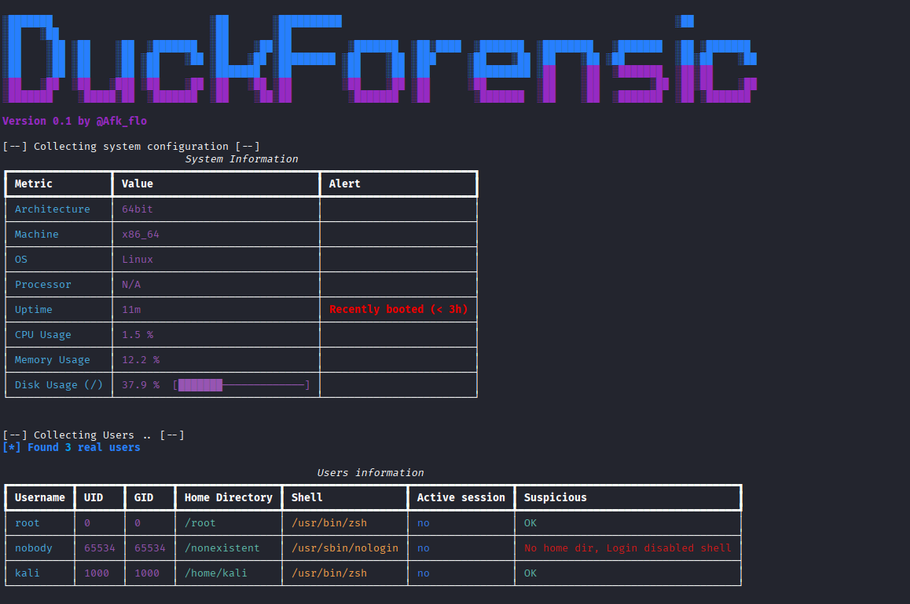

# 🚀 DuckForensic 
A simple and fast Linux forensic tool




What's for ?
> This script is designed to give you a quick and effective overview of your system after a potential compromise. It analyzes various folders, users, and processes in search of suspicious elements.
---

## 🧩 Features

**(currently - V 0.1)**

- System information retrieval
- User retrieval and analysis
- Analysis of sensitive files to check for possible compromises.

**(todo)**
- Extended scan for server files
- Scan for suspicious process
- Extraction and checkSum all the way
- Deep scanning

---

## 📦 Installation

Clone this repo & follow this *simple* instructions :
```bash
git clone https://github.com/Afk-flo/DuckForensic.git
cd DuckForensic
pip install -r requirements.txt
python3 foren.py
````
